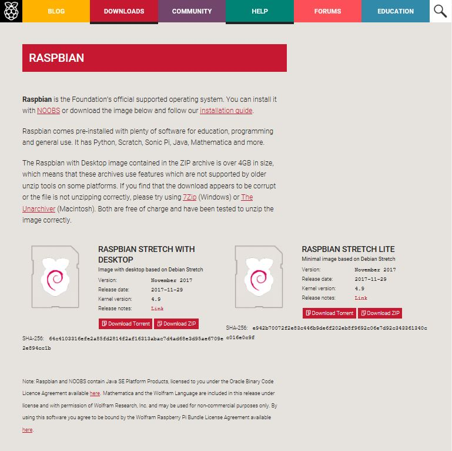
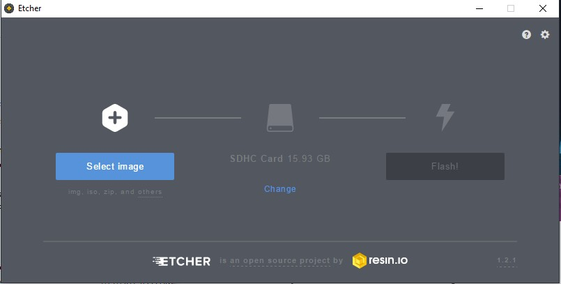
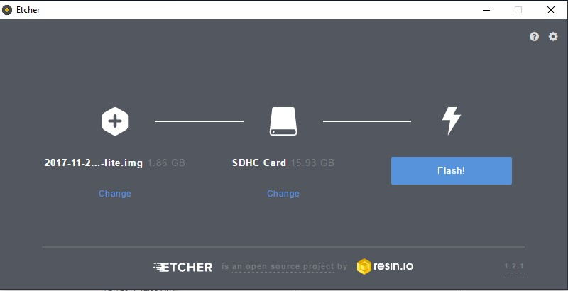
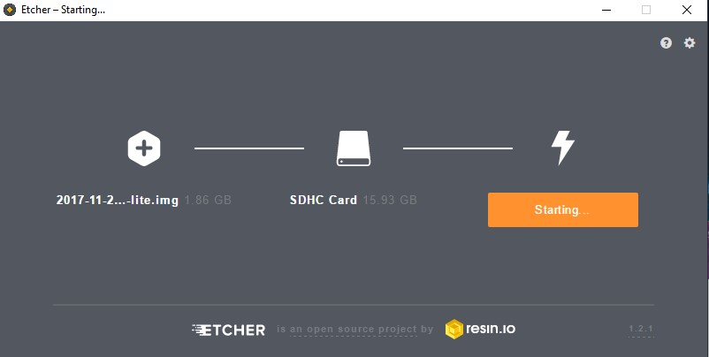
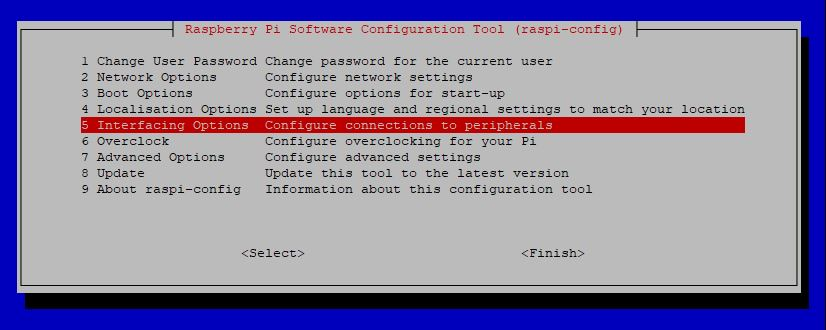

Chapter 1 - Install the Raspberry Pis
=====================================

Setup the Raspberry Pi manually
----------------------------------

1 - Download [Raspbian Stretch Lite](https://www.raspberrypi.org/downloads/raspbian/)



2 - Burn Raspbian to a micro SD Card

_As preconized on the Raspberrypi.org website, I use [Etcher](https://etcher.io/)
but you can choose the dd command (Linux/Mac) or Win32DiskImager (Windows)
if you prefer._





3 - Enable the SSH

Without any display, you can easily enable the SSH by adding a file named
**ssh** without any extension, onto the boot partition of the micro SD Card.
/!\ You should mount the partition before execute a simple touch.

```
  touch $SD_CARD_BOOT_PARTITION/ssh
```

With a display plug in your RaspPi, execute `sudo raspi-config`
>> Interfacing Options \ P2 SSH



4 - SSH Access

Download and install [Putty](https://www.putty.org/) for Window users.

-> Go to [Next Chapter](./02-Setup-network.md)
